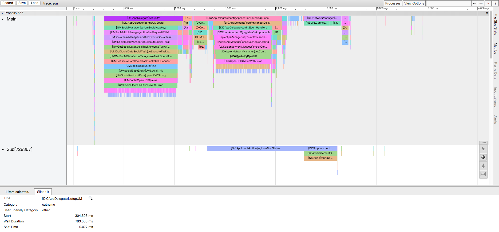

# AppTrace

[](https://travis-ci.org/chenzhengxu2/AppTrace)
[](https://cocoapods.org/pods/AppTrace)
[](https://cocoapods.org/pods/AppTrace)
[](https://cocoapods.org/pods/AppTrace)

## Usage

用来追踪app运行期间所有调用的方法以及耗时时间，支持真机和模拟器，方便开发者对于app进行优化。如图：



## How it works

通过 [fishhook](https://github.com/facebook/fishhook) 钩住 `objc_msg_send` 方法，在替代的方法中实现参数寄存器值的保存与恢复，从而在原始的 `objc_msg_send` 方法前后调用自定义方法，又不影响本身函数的调用，在 `arm64` 下的大致逻辑是：

```
保存寄存器x0 - x8，q0 - q7到栈上，
记录class，selector，startTime，lr
恢复寄存器x0 - x8，q0 - q7，
调用原始objc_msg_send，
保存寄存器x0 - x8，q0 - q7到栈上，
记录endTime，
恢复寄存器x0 - x8，q0 - q7，以及lr
```

最后产出物为 `trace.json` 文件，使用项目中的脚本 `sh perf_file.sh` 对文件进行处理，可打开网站 `chrome://tracing` 直接拖入 `.json` 文件展示，也可以使用脚本 `sh generate_html.sh` 输出稳定的`html`文件。

## Sample

项目下的 `Generate` 有案例展示。

## Quick start

AppTrace is available through [CocoaPods](https://cocoapods.org). To install
it, simply add the following line to your Podfile:

```ruby
pod 'AppTrace'
```
Import the framework header，then call start method.

```objc
#import "AppTrace.h"

// call it wherever you want, pefer to call in main.m like Example
[AppTrace startTrace];
```

## Thanks

1. Locus : https://github.com/hzfanfei/locus
1. HookZz : https://github.com/jmpews/HookZz
1. catapult : https://github.com/catapult-project/catapult
1. AppleTrace : https://github.com/everettjf/AppleTrace
1. fishhook : https://github.com/facebook/fishhook

## License

AppTrace is available under the MIT license. See the LICENSE file for more info.
